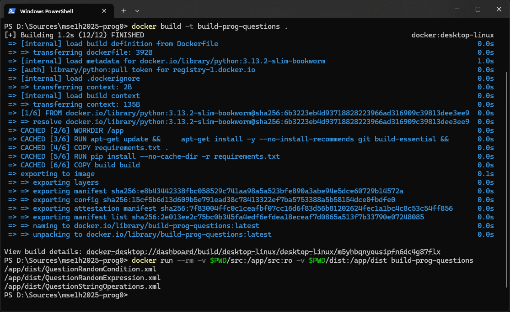

# Сборка

Для удобства сборка была вынесена в Docker. Запуск сборки (из корня репозитория):

```sh
docker build -t build-prog-questions .
docker run --rm -v $PWD/src:/app/src:ro -v $PWD/dist:/app/dist build-prog-questions
```

После удачной сборки в консоль должно вывестись сообщение `Задачи успешно собраны` и имена файлов задач. Собранные задачи помещаются в папку `dist`. Пример вывода при удачной сборке:



### Интеграция модуля генерации задач в CodeRunner

После сборки необходимо импортировать XML файл в систему Moodle.

Для этого нужно перейти в *режим редактирования*, после нажать *Добавить элемент или ресурс*, выбрать *Тест*, ввести необходимые настройки в частности *Название*.

После создания теста переходим в вкладку *Банк вопросов*, в выпадающем списке с названием *Вопросы* выбираем импорт, выбираем формат *Формат Moodle XML* и загружаем XML-файл

После загрузки входим в вкладку *Вопросы*, жмём кнопку *Добавить ∨* находим свой вопрос, выбираем *+ из банка вопросов*, находим нужный вопрос с помощью названий и значка *лупа плюс* справа от названия вопроса, добавляем задание плюсиком.

Нажимаем *Сохранить* и тест добавлен.

# GitHub Actions

В проекте настроен workflow `.github/workflows/run-tests.yml`, запускающий тесты с отчётом о покрытии и сборку проекта. Workflow запускается при открытии пул реквеста или изменении ветки, связанной с ним, или при взаимодействии с веткой `main`.

# Документация

## Класс `QuestionBase` *(Абстрактный)*

### Методы класса
- `initTemplate(cls, *, seed: int | EllipsisType | None, **parameters)`:
  - Инициализация в параметрах шаблона Twig.
  - `seed` - сид вопроса. Если равен None или Ellipsis, то берётся тот, что предоставляет Moodle.
  - `parameters` - любые параметры, поддерживаемые JSON.

- `initWithParameters(cls, parameters: str)`:
  - Инициализация с параметрами шаблона Twig.
  - Параметры: JSON-строка.

- `getTemplateParameters(self) -> str`:
  - Возвращает параметры в формате JSON для шаблонизатора Twig.

- `test(self, code: str) -> str`:
  - Логика проверки кода.
  - Параметры: Код студента (строка).
  - Возвращаемое значение: Результат проверки (строка).

- `runTest(self, code: str) -> str`:
  - Запуск проверки кода и подсчёта процента коментариев в коде
  - Параметры: Код студента (строке).
  - Возвращаемое значение: JSON в виде строки для отображения результата шаблону-комбинатору

### Свойства класса

- `questionName: str`:
  - Название вопроса.

- `questionText: str`:
  - Текст вопроса.

- `preloadedCode: str`:
  - Предзагруженный код.

### Пример реализации:
```python
from .QuestionBase import QuestionBase
from io import StringIO
from contextlib import redirect_stdout

class PrintSeedQuestion(QuestionBase):
    @property
    def questionName(self) -> str:
        return 'Печать случайного seed'

    @property
    def questionText(self) -> str:
        return f'Напечатайте в консоль случайный сид: {self.seed}'

    @property
    def preloadedCode(self) -> str:
        return f'# TODO: напечатать {self.seed}'

    def test(self, code: str) -> str:
        with StringIO() as f, redirect_stdout(f):
            try:
                eval(code)
            except Exception as e:
                return str(e)

            result = f.getvalue()

        if result.strip() != f'{self.seed}':
            return 'Wrong answer'

        return 'OK'

```

## Класс `QuestionRandomCondition`
Класс обёртки для задания изменения массива по случайному условию.

### Методы класса:

- `__init__(self, *, seed: int, condition_length: int, array_length: int, strictness: float)` - метод инициализации

* `seed` - случайное зерно, используемое для воспроизводимости результатов псевдослучайной генерации случайных значений;
* `condition_length` - целое число, указывающее длину условия (количество операндов в генерируемом условии);
* `array_length` - целое число, указывающее длину массива, элементы которого нужно изменить;
* `strictness` - число с плавающей точкой, в диапазоне `[0; 1]`, регулирующее въедливость проверки.
  * Общее количество тестов вычисляется по формуле: `min_tests_number + strictness * (max_tests_number - min_tests_number)`, где `min_tests_number = 20` и `max_tests_number = 50`
    * 8 тестов проверяют работу программы на массивах с одинаковыми числами (меняется знак и порядок чисел)
    * 8 тестов проверяют работу программы на массивах с чередованием близких к нулю и больших по модулю чисел (меняется знак и порядок чисел)
    * Остальные тесты являются рандомизированными.
    Для каждого теста выбирается диапазон, внутри которого генерируются значения массива входных данных.
    Поскольку работа программы зависит от порядка входных данных, то количество тестов распределяется равномерно между разными порядками.
    * Для каждого одного набора тестов одного порядка генерируются значения, а также меняется количество пробелов.
    Большему количеству тестов соответствует большее количество тестов с пробелами разной длины между элементами входного массива.
  * Таким образом увеличение значения параметра `strictness` увеличивает количество тестов, отвечающих за покрытие разных промежутков значений элементов массива и входных данных с разным числом пробелов.

- `parse(self, task_text: str)` - метод, позволяющий получить характеристики сгенерированного условия, которые не хранятся в исходном классе как отдельные атрибуты.

* `task_text` - текст условия сгенерированного задания.

- `test_case(self, arr: list, code: str, space_amount: int) -> str` - метод, позволяющий запустить переданный код на конкретных входных данных.

* `arr` - список чисел, подающийся на вход программе;
* `code` - код, тестирование которого необходимо произвести;
* `space_amount` - количество пробелов, зависящее от въедливости проверки.

В зависимости от результата работы программы возвращается одна из строк:

* `OK` - если результат совпал с ожидаемым результатом;
* `Ошибка: ожидалось '{expected_output}', получено '{output}'` - если результат работы программы не совпадает с ожидаемым результатом;
* `Ошибка компиляции: {e}` - если произошла ошибка компиляции;
* `Ошибка выполнения (код {e.exit_code}): {e}` - если произошла ошибка выполнения.

- `test_same_numbers_case(self, code: str, amount: int, exponentiation: int) -> str` - метод, организующий тестирование на входных данных, состоящих из повтора одного числа.

* `code` - код, тестирование которого необходимо произвести;
* `amount` - целое число, количество вариантов входных данных (отличаются количеством пробелов);
* `exponentiation` - целое число, показатель степени элементов массива входных данных. При значении `>9` осуществляет проверку выхода за границу `INT`.

В случае возникновения ошибки выполнение остальных тестов заканчивается и возвращается соответствующая полученной ошибке строка. Если все тесты выполнены корректно - метод возвращает строку `OK`.

- `test_alternate_numbers_case(self, code: str, amount: int, exponentiation: int) -> str` - метод, организующий тестирование на входных данных, состоящих из чередования близких к нулю и удалённых от нуля значений.

* `code` - код, тестирование которого необходимо произвести;
* `amount` - целое число, количество вариантов входных данных (отличаются количеством пробелов);
* `exponentiation` - целое число, показатель степени элементов массива входных данных. При значении `>9` осуществляет проверку выхода за границу `INT`.

В случае возникновения ошибки выполнение остальных тестов заканчивается и возвращается соответствующая полученной ошибке строка. Если все тесты выполнены корректно - метод возвращает строку `OK`.

- `test_random(self, code: str, amount: int, upper_border: int) -> str` - метод, организующий тестирование с рандомизированными входными данными.

* `code` - код, тестирование которого необходимо произвести;
* `amount` - целое число, количество вариантов входных данных;
* `upper_border` - целое число `N`, ограничение на промежуток чисел `[-10^N; 10^N]` для генерации элементов массива;

В случае возникновения ошибки выполнение остальных тестов заканчивается и возвращается соответствующая полученной ошибке строка. Если все тесты выполнены корректно - метод возвращает строку `OK`.

- `distribute_random_tests(self, total_amount: int, exponentiation_amount: int) -> list` - метод, распределяющий количество оставшихся тестов среди рандомизированных.

* `total_amount` - целое число, количество рандомизированных тестов;
* `exponentiation_amount` - целое число, количество различных групп тестов (в одну группу объединены тесты с одним значением `upper_border`).

- `test(self, code: str) -> str` - метод, организующий тестирование в целом.

* `code` - код, тестирование которого необходимо произвести;

В случае возникновения ошибки выполнение остальных тестов заканчивается и возвращается соответствующая полученной ошибке строка. Если все тесты выполнены корректно - метод возвращает строку `OK`.

### Свойства класса:

- `questionName: str` - название вопроса.

- `questionText: str` - задание/текст вопроса.

- `preloadedCode: str` - код, который подгружается в поле редактирования кода.

## Класс `QuestionRandomExpression`

Класс для генерации и тестирования задач на вычисление выражений с использованием случайных данных.

### Методы класса

- `__init__(self, *, seed: int, vars=['x', 'y', 'z', 'w'], operations=['+', '-', '*', '&', '|'], length=5, minuses_threshold=0, brackets_treshold=0, minus_symbol="-", all_variables=False, strictness=0)` - Метод инициализации экземпляра.
  - **seed**: Сид для генерации случайных данных.
  - **vars**: Список переменных для генерации выражений (по умолчанию `['x', 'y', 'z', 'w']`).
  - **operations**: Допустимые операции для выражений (по умолчанию `['+', '-', '*', '&', '|']`).
  - **length**: Длина генерируемого выражения (по умолчанию `5`).
  - **minuses_threshold**: Порог для использования унарных минусов (в диапазоне `[0; 1]`, по умолчанию `0`).
  - **brackets_treshold**: Порог для генерации скобок (в диапазоне `[0; 1]`, по умолчанию `0`).
  - **minus_symbol**: Символ для отображения минуса (по умолчанию `"-"`).
  - **all_variables**: Флаг обязательного использования всех переменных (по умолчанию `False`).
  - **strictness**: Уровень строгости проверки (в диапазоне `[0; 1]`, влияет на количество тестов).


- `generate_c_code(self)`
Генерирует код на языке C для вычисления сгенерированного выражения.

Возвращает строку с кодом на языке C.

- `test(self, code: str) -> str`
Организует тестирование переданного кода.

- **code**: Код, который необходимо протестировать.

Возвращает одну из строк:
- `"OK"` — если код прошел все тесты.
- `"Ошибка компиляции"` — если код не компилируется.
- `"Ошибка выполнения [{exit_code}]: {error}"` — если код завершился с ошибкой выполнения.
- Сообщение об ошибке теста с описанием входных данных и ожидаемого результата.

### Свойства класса

- `preloadedCode: str`
Код, который подгружается в поле редактирования кода.

- `questionText: str`
Текст задания. Генерируется автоматически и включает:
    - Условие задачи.
    - Формат ввода и вывода.
    - Пример входных и выходных данных.

- `questionExpression: str`
Генерируемое выражение для задачи. Использует заданные переменные, операции и параметры генерации.


## Класс `QuestionStringOperations`
Класс обёртки для задания применения заданных операций к строке.

### Методы класса:

- `__init__(self, *, seed: int, num_operations: int, min_length: int, max_length: int, strictness: float)` - метод инициализации класса.

* `seed` - случайное зерно, используемое для воспроизводимости результатов псевдослучайной генерации случайных операций, строк и тестов;
* `num_operations` - целое число, указывающее количество операций задания;
* `min_length` - целое число, указывающее минимальную длину тестовых строк;
* `max_length` - целое число, указывающее максимальную длину тестовых строк;
* `strictness` - число с плавающей точкой, в диапазоне `[0; 1]`, регулирующее въедливость проверки.
  * Общее количество тестов вычисляется по формуле: `7 + 20 + strictness * 30`
    * 7 тестов проверяют работу программы на крайних случаях каждой из операций.
    * Остальные тесты являются рандомизированными, количество которых равно `7 + 20 + strictness * 30`.
    * Для каждого рандомизированного теста выбирается входная строка. После этого в каждую входную строку добавляет шум в зависимости от параметра `strictness`.
  * В зависимоти от параметра `strictness` меняется количество рандомизированных тестов. Также в зависимости от этого параметра изменяется количество шума в рандомизированных строках.

- `noise_input_string(self, input_string: str)` - метод, добавляющий шум в строку.

* `input_string` - входная строка, в которую нужно добавить шум.

Шум генерируется по следующему принципу:

1. На каждом этапе метода ведётся учёт длины строки, чтобы итоговая длина не вышла за пределы, описанные в условии.
2. Шумные символы выбираются из следующего набора `!@#$%^&*()[]{}/?|~ `
3. На основе параметра `strictness` получается параметр `noise_level`, который указывает на количество шумовых символов, которые будут добавляться к каждому слову.
4. Далее входная строка разбивается на слова и для каждого слова с шансом `strictness` принимается решение добавлять шумовые символы или нет. Шумовые символы добавляются только по краям каждого слова. Стороная, с которой у слова добавится шум определяется случайно - 50% на каждую сторону.
5. В конце слова с шумом склеиваются пробелом.

- `test_case(self, runner: CProgramRunner, input_string: str, noise: bool = True)` - метод, позволяющий запустить переданный код на конкретных входных данных.

* `runner` - раннер, который содержит скомпилированный код студента;
* `input_string` - входная строка, на которой будет происходить тестирования;
* `noise` - флаг, который определяет нужно ли добавлять в входную строку шум или нет.

В зависимости от результата работы программы возвращается одна из строк:

* `OK` - если результат совпал с ожидаемым результатом;
* `Ошибка: ожидалось '{expected_output}', получено '{output}'` - если результат работы программы не совпадает с ожидаемым результатом;

- `test(self, code: str) -> str` - метод, организующий тестирование в целом.

* `code` - код, тестирование которого необходимо произвести;

В зависимости от результата работы программы возвращается одна из строк:

* `OK` - если тестируемый код прошёл все тесты;
* `Ошибка: ожидалось '{expected_output}', получено '{output}'` - если результат работы программы студента не совпадает с ожидаемым результатом;
* `Ошибка компиляции: {e}` - если код студента не смог успешно скомпилироваться
* `Ошибка выполнения (код {e.exit_code}): {e}` - если код студента заврешился ошибкой выполнения.


### Свойства класса:

- `questionName: str` - название вопроса.

- `questionText: str` - задание/текст вопроса.

- `preloadedCode: str` - код, который подгружается в поле редактирования кода.

## Класс `CProgramRunner`
Класс для компиляции и выполнения программ на языке C.

### Методы класса:
- `__init__(self, c_code: str)` - инициализирует объект класса с компиляцией переданного C-кода

* `c_code` - исходный код на C в виде строки
* Компилирует код в исполняемый файл и сохраняет путь к нему

- `_compile(self) -> str` - компилирует код в исполняемый файл
* *Возвращаемое значение* - путь к скомпилированному исполняемому файлу
* *Исключение* - `CompilationError` если компиляция не удалась

- `run(self, input_data: str = "", timeout: int = 60) -> str` - запускает скомпилированную программу с передачей входных данных
* `input_data` - входные данные для программы (по умолчанию пустая строка)
* `timeout` - максимальное время выполнения программы в секундах (по умолчанию 60 секунд)
* *Возвращаемое значение* - вывод программы
* *Исключение* - `ExecutionError` если выполнение программы завершилось с ошибкой

- `__del__(self)` - очищает временные файлы при удалении объекта

### Исключения класса:
- `CompilationError` - исключение, вызываемое при ошибке компиляции C-кода

- `ExecutionError` - исключение, вызываемое при ошибке выполнения скомпилированной программы
* `message` - сообщение об ошибке
* `exit_code` - код завершения программы

## Вспомогательный класс `ExitCodeHandler`:
Класс для обработки кодов завершения и сигналов.

### Методы класса:

- `get_exit_message(self, exit_code) -> str` - преобразует код завершения в текстовое сообщение

* `exit_code` - код завершения программы
* *Возвращаемое значение* - текстовое описание кода завершения

### Пример использования:
```python
from CProgramRunner import CProgramRunner, CompilationError, ExecutionError

C_CODE = """
#include <stdio.h>

int main() {
    printf("42\\n");
    return 0;
}
"""

try:
    runner = CProgramRunner(C_CODE)
    output = runner.run()

    print("Программа успешно выполнена!")
    print("Вывод программы:", output)

except CompilationError as e:
    print("Ошибка компиляции:")
    print(str(e))

except ExecutionError as e:
    print(f"Ошибка выполнения [{e.exit_code}]: {str(e)}")

except Exception as e:
    print("Неожиданная ошибка:")
    print(str(e))

```
