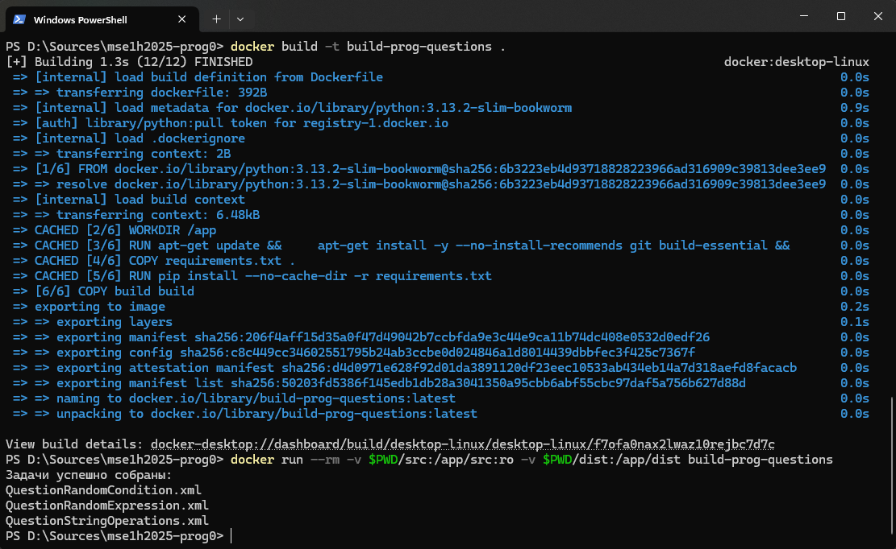

# Сборка

Для удобства сборка была вынесена в Docker. Запуск сборки (из корня репозитория):
```sh
docker build -t build-prog-questions .
docker run --rm -v $PWD/src:/app/src:ro -v $PWD/dist:/app/dist build-prog-questions
```

Альтернативно сборку можно запустить и без Docker, установив зависимости проекта и запустив `build/build.py`:
```sh
pip install -r requirements.txt
python build/build.py
```

После удачной сборки в консоль должно вывестись сообщение `Задачи успешно собраны` и имена файлов задач. Собранные задачи помещаются в папку `dist`. Пример вывода при удачной сборке:



### Интеграция задач в CodeRunner

После сборки необходимо импортировать XML файл в систему Moodle.

Для этого нужно перейти в *режим редактирования*, после нажать *Добавить элемент или ресурс*, выбрать *Тест*, ввести необходимые настройки в частности *Название*.

После создания теста переходим во вкладку *Банк вопросов*, в выпадающем списке с названием *Вопросы* выбираем импорт, выбираем формат *Формат Moodle XML* и загружаем XML-файл

После загрузки входим во вкладку *Вопросы*, жмём кнопку *Добавить ∨* находим свой вопрос, выбираем *+ из банка вопросов*, находим нужный вопрос с помощью названий и значка *лупа плюс* справа от названия вопроса, добавляем задание плюсиком.

Нажимаем *Сохранить* и тест добавлен.

### Как убедиться, что вопрос успешно добавлен

Необходимо перейти в *режим редактирования*.

Далее следует зайти в созданный тест. Перейдите в раздел *Вопросы* и нажмите на нужный вам вопрос, чтобы открылась вкладка с редактированием вопроса.

В случае успешного импорта вопроса должны быть заполнены следующие поля:
* *Тип вопроса CodeRunner > Настройка > Настроить* содержит галочку
* *Тип вопроса CodeRunner > Параметры шаблона* должен содержать примерно такой код (может немного отличаться)
  ```python
  import sys
  sys.path.insert(0, 'bundle.zip')
  from prog_questions import QuestionStringOperations

  question = QuestionStringOperations.initTemplate(seed=..., num_operations=3, min_length=30, max_length=100, strictness=1)
  print(question.getTemplateParameters())
  ```

* *Тип вопроса CodeRunner > Элементы управления параметрами шаблона* содержит галочки у полей *Hoist template parameters*, *Twig all*, *Evaluate per student*
* *Настройка > Шаблон* должен содержать примерно такой код (может немного отличаться)
  ```python
  import sys
  sys.path.insert(0, 'bundle.zip')
  from prog_questions import QuestionStringOperations

  question = QuestionStringOperations.initWithParameters("""{{ PARAMETERS | e('py') }}""")
  print(question.test("""{{ STUDENT_ANSWER | e('py') }}"""))
  ```
* *Настройка > Элементы управления шаблоном* содержит галочки у поля *Является комбинатором*
* *Настройка > Оценка* выбран *Шаблон-оценщик*
* *Общее > Название вопроса* содержит название вопроса
* *Общее > Текст вопроса* содержит `{{ QUESTION_TEXT }}`
* *Предварительная загрузка поля ответа > Предварительная загрузка поля ответа* содержит `{{ PRELOADED_CODE }}`
* *Поддерживаемые файлы > Поддерживаемые файлы* содержит файл `bundle.zip`

### Пример настройки вопроса

Для настройки вопроса преподавателю необходимо перейти в *режим редактирования*. Далее следует зайти в созданный тест.

Перейдите в раздел *Вопросы* и нажмите на нужный вам вопрос, чтобы открылась вкладка с редактированием вопроса.

На странице редактирования вопроса найдите раздел *Тип вопроса CodeRunner*. В нем в части *Параметры вопроса* содержится код (может немного отличаться):

```python
import sys
sys.path.insert(0, 'bundle.zip')
from prog_questions import QuestionStringOperations

question = QuestionStringOperations.initTemplate(seed=..., num_operations=3, min_length=30, max_length=100, strictness=1)
print(question.getTemplateParameters())

```

Настройка вопроса осуществляется путем задания параметров метода `initTemplate()` класса вопроса, наследуемого от `QuestionBase`.

В данном случае вопрос настроен так, чтобы условие содержало 3 операции, длина тестовых строк была от 30 до 100 символов, а въедливость проверки была максимальной.

Таже есть возможность зафиксировать конкретный сид вопроса, заменив `...` аргумента `seed` на нужный сид.

Описание параметров настройки каждого вопроса можно найти в [Документации](https://github.com/moevm/mse1h2025-prog0/tree/main#документация).

# Создание собственных задач

Очень подробный гайд по созданию собственных задач представлен в Wiki репозитория. Подробнее [тут](https://github.com/moevm/mse1h2025-prog0/wiki/Создание-новых-задач)

# Документация

Документация вынесена в отдельную страницу в Wiki репозитория. Подробнее [тут](https://github.com/moevm/mse1h2025-prog0/wiki/Документация)
